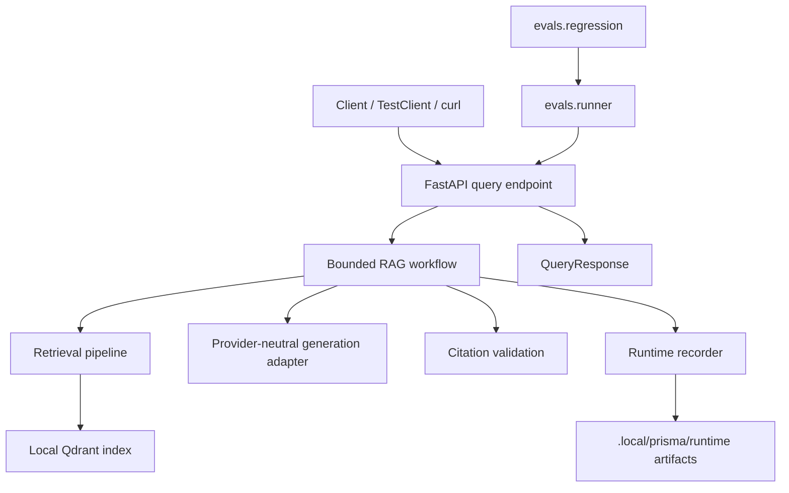
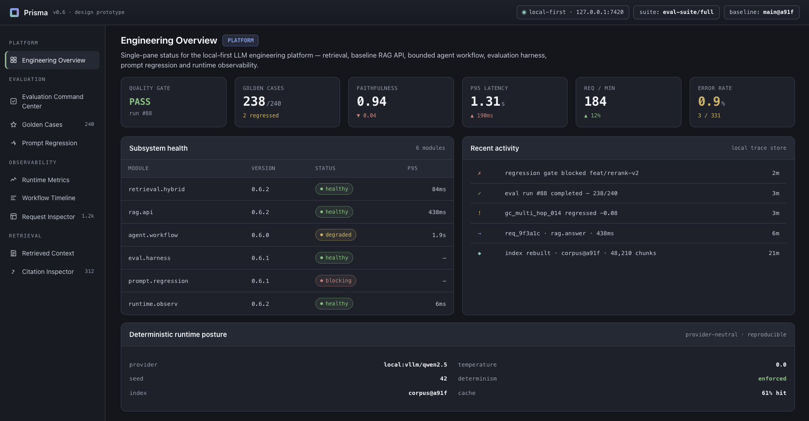
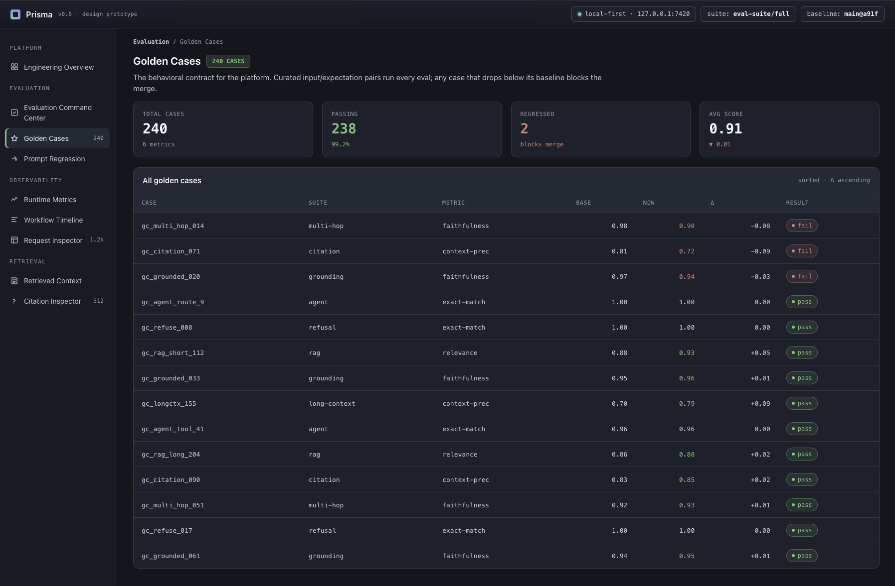
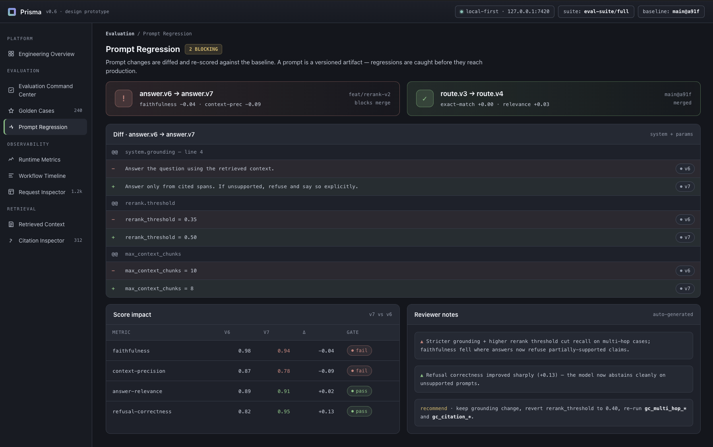
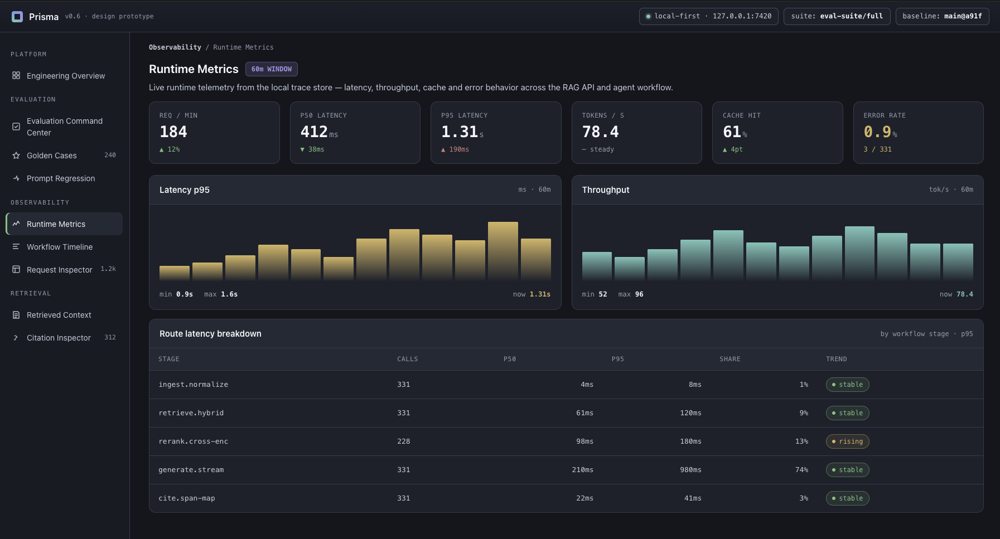
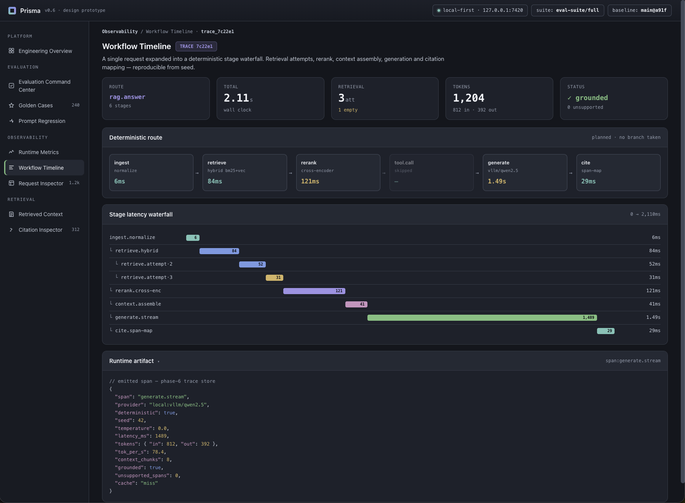
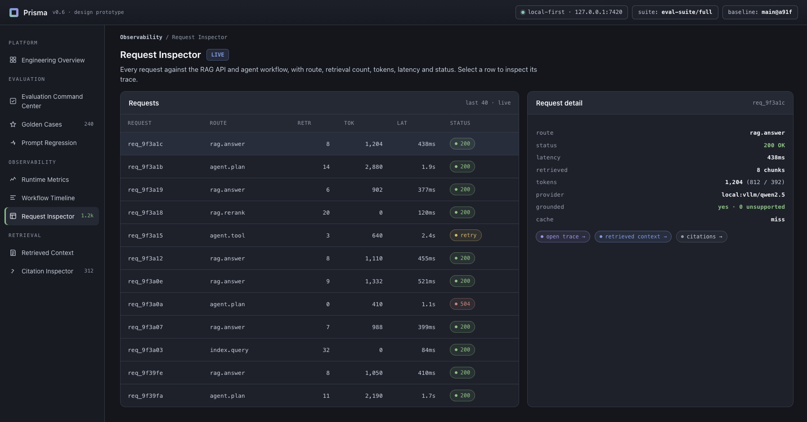
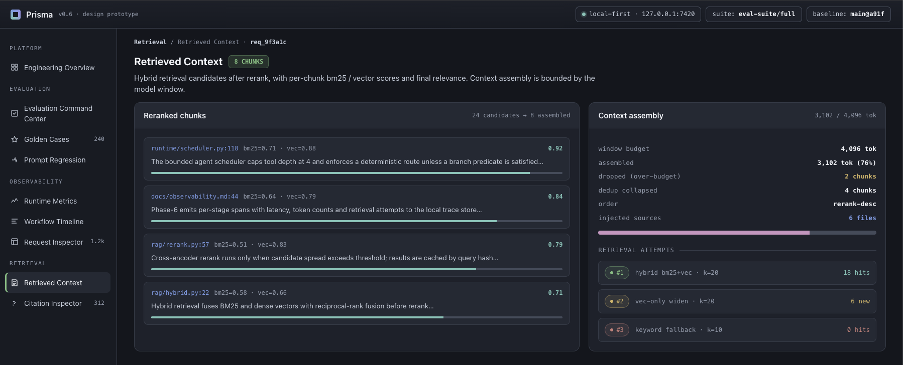
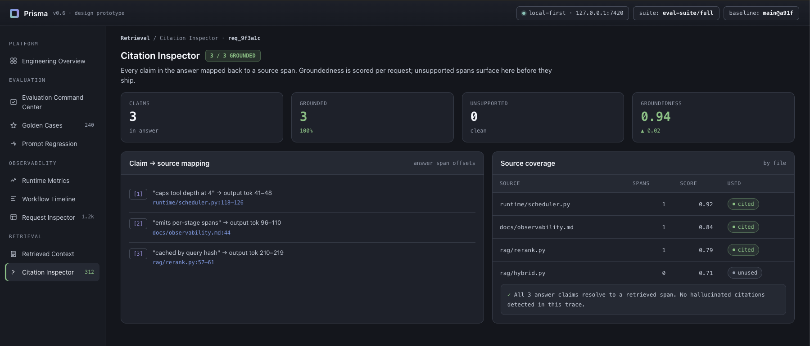

# Prisma

> Local-first production LLM engineering platform.

Prisma is a reproducible RAG and agent-workflow system that treats LLM behavior like production software: indexed context, cited answers, golden-case evaluation, prompt regression, and request-level runtime observability.

**Status:** Python 3.11+ · Local-first · Phases 0-7 complete · CI/CD Evaluation Gate · No hosted services required · Design prototype included


## What Prisma Is

Prisma is a local-first Production LLM Engineering Platform. It is built as a small, reproducible reference system for the operational layer around RAG and bounded agent workflows.

It currently:

- Indexes a committed sample corpus locally.
- Answers questions through a typed RAG API.
- Routes requests through a bounded workflow.
- Measures quality through golden cases.
- Compares prompt behavior against a committed baseline.
- Records request-local runtime metrics.
- Gates changes with GitHub Actions using the local validation sequence.
- Includes a design-only dashboard prototype for inspecting those artifacts.

## Why Prisma Exists

LLM systems do not become reliable through prompts alone. A credible LLM application needs retrieval boundaries, workflow control, evaluation data, regression checks, and runtime observability so behavior can be reviewed and reproduced.

Prisma demonstrates that thesis in one local repository:

- Retrieval provides grounded context.
- Workflow bounds autonomy and retry behavior.
- Evaluation defines expected behavior.
- Prompt regression detects behavior drift.
- Observability makes a single request inspectable.

## Feature Overview

| Capability | What it demonstrates | Status |
|---|---|---|
| Ingestion and indexing | Local corpus loading, chunking, embeddings, Qdrant-local index | Complete |
| Baseline RAG API | Typed `POST /query`, cited answers, structured errors | Complete |
| Bounded workflow | Validate, retrieve, assess, rewrite once, generate, validate citations | Complete |
| Evaluation harness | Golden cases, deterministic metrics, scorecard artifact | Complete |
| Prompt regression | Prompt fingerprinting, baseline comparison, regression report | Complete |
| Runtime observability | Runtime block, per-request artifacts, inspection command | Complete |
| CI/CD Evaluation Gate | GitHub Actions validation, scorecard pass-rate gate, report artifacts | Complete |
| Dashboard prototype | Design-only visual inspection surface for evals, regression, runtime, workflow, citations | Prototype |

## Architecture Overview

Prisma keeps executable application logic in `app/`, data assets in `configs/`, `datasets/`, and `prompts/`, and measurement code in `evals/`. Evaluation observes the system through the public API boundary, runtime artifacts are generated under `.local/prisma/`, and model providers remain behind provider-neutral adapters.



## Dashboard Showcase

The dashboard prototype is a design-only inspection surface for the engineering artifacts Prisma already produces locally: scorecards, prompt-regression reports, runtime metrics, workflow routes, retrieved context, and citations.

| View | What it shows |
|---|---|
|  | Engineering Overview: top-level status across evaluation, regression, and runtime surfaces. |
|  | Evaluation Command Center: integrated quality and operational view used as the README hero. |
|  | Golden Cases: curated evaluation cases and expected behavior. |
|  | Prompt Regression: baseline comparison and prompt-change visibility. |
|  | Runtime Metrics: request-level latency and count summaries. |
|  | Workflow Timeline: bounded workflow route and stage progression. |
|  | Request Inspector: local request artifact inspection. |
|  | Retrieved Context: source chunks used to ground an answer. |
|  | Citation Inspector: citation grounding and retrieved-source traceability. |

## Quick Start

Prerequisite: Python 3.11 or newer. The examples below use `python3.11`; replace it with the Python 3.11+ executable available on your machine.

```bash
python3.11 -m venv .venv
source .venv/bin/activate
python -m pip install -U pip
python -m pip install -e ".[dev]"
python -m app.retrieval.index
python -m evals.runner
python -m evals.regression
python -m app.observability.inspect
uvicorn app.api.main:app --host 127.0.0.1 --port 8000
```

Generated index files, scorecards, regression reports, and runtime request artifacts are written under `.local/prisma/` and ignored by git.

GitHub Actions runs the same validation sequence on push and pull requests to `main`.
CI enforces the evaluation pass-rate through `.local/prisma/evals/scorecard.json`.
Regression reports and runtime metrics remain informational; generated reports are uploaded as CI artifacts, not committed.

Query the local API after starting `uvicorn`:

```bash
curl -s \
  -H "Content-Type: application/json" \
  -H "Accept: application/json" \
  -d '{"question":"What does Prisma mean by provider boundaries?","top_k":4}' \
  http://127.0.0.1:8000/query
```

## Core Commands

| Command | Purpose | Output |
|---|---|---|
| `python -m app.retrieval.index` | Build or verify the local vector index | `.local/prisma/index/` |
| `python -m evals.runner` | Run golden-case evaluation | `.local/prisma/evals/scorecard.json` |
| `python -m evals.regression` | Compare prompt behavior with the committed baseline | `.local/prisma/evals/regression.json` |
| `python -m app.observability.inspect` | Inspect the latest runtime request artifact | Console summary from `.local/prisma/runtime/latest-request.json` |
| `uvicorn app.api.main:app --host 127.0.0.1 --port 8000` | Run the local API | `POST /query` endpoint |
| `python -m pytest` | Run correctness tests | Test report |
| `python -m ruff check .` | Lint | Lint report |
| `python -m mypy app evals` | Type check application and eval code | Type-check report |

## Evaluation

Prisma evaluates behavior with committed golden cases and deterministic metrics.

- Golden cases live at `evals/golden/cases.jsonl`.
- Metrics are deterministic and implemented in `evals/metrics.py`.
- Routine scorecards are generated at `.local/prisma/evals/scorecard.json`.
- The promoted Phase 4 baseline lives at `evals/baselines/phase4-baseline.json`.

Run the evaluation harness:

```bash
python -m evals.runner
```

The runner exercises `POST /query` through FastAPI `TestClient`, computes metric results, and prints a concise pass-rate summary.
In CI, the generated scorecard is also read by the Phase 7 pass-rate gate.

## Prompt Regression

Prompt regression compares current prompt-driven behavior with the committed Phase 4 baseline.

- Prompt fingerprinting tracks the configured prompt asset.
- The prompt snapshot lives at `evals/baselines/phase4-prompt-snapshot.json`.
- `python -m evals.regression` compares current evaluation output with the committed baseline.
- Routine regression reports are generated at `.local/prisma/evals/regression.json`.
- Regression remains informational in Phase 7; CI fails only if the runner crashes.

Run prompt regression:

```bash
python -m evals.regression
```

## Runtime Observability

Successful `POST /query` responses include a compact `runtime` block when observability is enabled. When observability is disabled, the response keeps `runtime: null`.

Full request-local artifacts are generated at:

- `.local/prisma/runtime/latest-request.json`
- `.local/prisma/runtime/requests/<request_id>.json`

Inspect the latest local runtime artifact:

```bash
python -m app.observability.inspect
```

Runtime artifacts contain timings, scalar counts, source paths, workflow route, and neutral generation backend/model IDs. They do not contain question text, prompt text, answer text, secrets, telemetry exports, or provider billing data.
Runtime metrics remain informational in Phase 7; CI fails only if inspection crashes.

## Repository Structure

```text
prisma/
├── app/                  # API, generation, retrieval, workflow, providers, persistence, observability
├── assets/               # Design prototype archive and dashboard screenshots
├── configs/              # Non-secret defaults
├── datasets/             # Sample corpus
├── docs/                 # Plans, architecture, ADRs, development docs
├── evals/                # Golden cases, metrics, scorecards, regression
├── .github/              # GitHub Actions validation and evaluation gate
├── prompts/              # Prompt assets
├── tests/                # Correctness tests
├── README.md
└── pyproject.toml
```

## Roadmap

| Phase | Focus | Status |
|---|---|---|
| Phase 0 | Repository skeleton | Complete |
| Phase 1 | Ingestion and indexing | Complete |
| Phase 2 | Baseline RAG API | Complete |
| Phase 3 | Bounded agent workflow | Complete |
| Phase 4 | Evaluation harness | Complete |
| Phase 5 | Prompt regression | Complete |
| Phase 6 | Observability and runtime metrics | Complete |
| README polish | README Showcase Polish | Complete |
| Phase 7 | CI/CD Evaluation Gate | Complete |
| Phase 8 | Reproducibility and docs polish | Future |

## What This Demonstrates

Prisma demonstrates:

- Local-first LLM application architecture.
- RAG over a committed corpus.
- Provider-neutral adapters.
- Bounded agent workflow design.
- Golden-case evaluation.
- Prompt fingerprinting and regression comparison.
- Request-level runtime observability.
- CI/CD evaluation gate with report artifacts.
- Reproducible Python project structure.
- Clear architecture and phase documentation.

## Design Prototype

The dashboard assets are included for design communication and review:

- `assets/prisma-prototype-v2.zip` contains the dashboard design prototype archive.
- Screenshots under `assets/screenshots/` are design showcase assets.
- The dashboard is design-only and is not a production frontend.
- The prototype visualizes concepts already represented by local artifacts: scorecards, regression reports, runtime metrics, workflow route, retrieved context, and citations.

## Boundaries / Non-Goals

Prisma keeps its current boundaries explicit:

- No hosted service is required for the default path.
- No telemetry upload.
- No deployment or release automation.
- No production dashboard yet.
- No external provider dependency required by the local default path.
- No claim that Prisma is used in production.
- No benchmark-leading or commercial-product claims.

## Documentation

- [Project plan](docs/PRISMA_PROJECT_PLAN_v0.1.md)
- [Repository architecture](docs/PRISMA_REPOSITORY_ARCHITECTURE_v0.1.md)
- [Phase 0 repository skeleton plan](docs/PRISMA_PHASE_0_REPOSITORY_SKELETON_PLAN_v0.1.md)
- [Phase 1 ingestion and indexing plan](docs/PRISMA_PHASE_1_INGESTION_INDEXING_PLAN_v0.1.md)
- [Phase 2 baseline RAG API plan](docs/PRISMA_PHASE_2_BASELINE_RAG_API_PLAN_v0.1.md)
- [Phase 3 agent workflow plan](docs/PRISMA_PHASE_3_AGENT_WORKFLOW_PLAN_v0.1.md)
- [Phase 4 evaluation harness plan](docs/PRISMA_PHASE_4_EVALUATION_HARNESS_PLAN_v0.1.md)
- [Phase 5 prompt regression plan](docs/PRISMA_PHASE_5_PROMPT_REGRESSION_PLAN_v0.1.md)
- [Phase 6 observability runtime metrics plan](docs/PRISMA_PHASE_6_OBSERVABILITY_RUNTIME_METRICS_PLAN_v0.1.md)
- [Phase 7 CI/CD evaluation gate plan](docs/PRISMA_PHASE_7_CICD_EVALUATION_GATE_PLAN_v0.1.md)
- [README showcase polish plan](docs/PRISMA_README_SHOWCASE_POLISH_PLAN_v0.1.md)
- [Development guide](docs/DEVELOPMENT.md)
