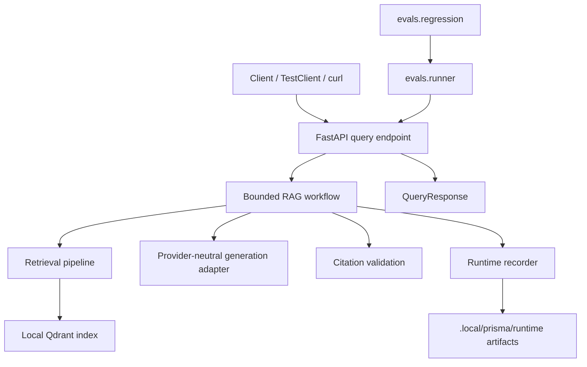

# README Showcase Polish Implementation Plan

> **For agentic workers:** REQUIRED SUB-SKILL: Use superpowers:subagent-driven-development (recommended) or superpowers:executing-plans to implement this plan task-by-task once approved. Steps use checkbox (`- [ ]`) syntax for tracking.

**Goal:** Rewrite `README.md` into a credible GitHub-facing technical showcase for Prisma before Phase 7, without exaggerating current project status.

**Architecture:** The future README should stay as the repository front door: concise, visual, command-oriented, and linked to deeper plans and architecture docs. It should describe implemented Phases 0-6, the design-only dashboard prototype, and the Phase 7 roadmap while preserving local-first, provider-neutral, evaluation-first positioning. The rewrite should modify `README.md` only and should reference existing assets without changing them.

**Tech Stack:** Markdown, GitHub-rendered images, GitHub Mermaid diagrams, existing Prisma Python commands, existing dashboard screenshots under `assets/screenshots/`, and the existing design prototype archive under `assets/prisma-prototype-v2.zip`.

---

> Production LLM Engineering Platform  
> Planning document only. This document defines a future README rewrite. It does not edit `README.md`, modify assets, or implement the rewrite.

**Status:** Draft v0.1  
**Date:** 2026-07-01  
**Document:** PRISMA_README_SHOWCASE_POLISH_PLAN_v0.1.md  
**Audience:** developers, AI engineers, ML engineers, technical reviewers, recruiters, university admissions/interview reviewers, and maintainers  
**Companions:** [PRISMA_PROJECT_PLAN_v0.1.md](PRISMA_PROJECT_PLAN_v0.1.md), [PRISMA_REPOSITORY_ARCHITECTURE_v0.1.md](PRISMA_REPOSITORY_ARCHITECTURE_v0.1.md), [PRISMA_PHASE_6_OBSERVABILITY_RUNTIME_METRICS_PLAN_v0.1.md](PRISMA_PHASE_6_OBSERVABILITY_RUNTIME_METRICS_PLAN_v0.1.md), [AGENTS.md](../AGENTS.md)

---

## 1. Purpose

The current README is operationally correct but undersells the completed system. Prisma now includes local ingestion and indexing, a baseline RAG API, bounded workflow routing, deterministic evaluation, prompt regression, runtime observability, and dashboard prototype screenshots. The README should make that system immediately understandable to a reader who lands on the repository with no prior context.

This plan defines a future README rewrite that should:

- Explain what Prisma is in one screen.
- Show the engineering dashboard prototype visually.
- Make the local run path easy to copy.
- Explain evaluation, regression, and observability without becoming a full manual.
- Communicate engineering judgment without recruiter-style self-promotion.
- Keep claims bounded to implemented or explicitly prototype-only capability.

## 2. Scope

### In Scope

- Rewrite `README.md` structure and copy.
- Embed existing screenshots from `assets/screenshots/`.
- Link to `assets/prisma-prototype-v2.zip` as a design-only prototype asset.
- Add a concise architecture diagram.
- Add command tables and local smoke paths.
- Add roadmap status covering completed Phases 0-6, README/dashboard polish, and future Phase 7.
- Add non-goals and credibility boundaries.

### Out of Scope

- Do not edit `assets/`.
- Do not modify screenshots.
- Do not regenerate the dashboard prototype.
- Do not implement a frontend.
- Do not add CI, badges that imply CI exists, or Phase 7 gates.
- Do not add hosted services, telemetry upload, provider comparisons, or production deployment claims.
- Do not edit architecture docs, ADRs, phase plans, code, configs, tests, prompts, datasets, eval baselines, or generated artifacts.

## 3. Future File Changes

The future README implementation should touch one tracked file:

```text
README.md
```

It should reference these existing assets without modifying them:

```text
assets/prisma-prototype-v2.zip
assets/screenshots/PRISMA_01_ENGINEERING_OVERVIEW.png
assets/screenshots/PRISMA_02_EVALUATION_COMMAND_CENTER.png
assets/screenshots/PRISMA_03_GOLDEN_CASES.png
assets/screenshots/PRISMA_04_PROMPT_REGRESSION.png
assets/screenshots/PRISMA_05_RUNTIME_METRICS.png
assets/screenshots/PRISMA_06_WORKFLOW_TIMELINE.png
assets/screenshots/PRISMA_07_REQUEST_INSPECTOR.png
assets/screenshots/PRISMA_08_RETRIEVED_CONTEXT.png
assets/screenshots/PRISMA_09_CITATION_INSPECTOR.png
```

## 4. Recommended README Structure

The future README should use the following section order.

### 1. Hero / Opening

Recommended title:

```markdown
# Prisma
```

Recommended tagline:

```markdown
Local-first production LLM engineering platform.
```

Recommended positioning sentence:

```markdown
Prisma is a reproducible RAG and agent-workflow system that treats LLM behavior like production software: indexed context, cited answers, golden-case evaluation, prompt regression, and request-level runtime observability.
```

Recommended hero image placement:

```markdown

```

Recommended status badge ideas:

- `Python 3.11+`
- `Local-first`
- `Phases 0-6 complete`
- `No hosted services required`
- `Design prototype included`

Do not add a CI/build badge before Phase 7 introduces CI.

### 2. What Prisma Is

Explain Prisma as a local-first Production LLM Engineering Platform. Use concrete language:

- It indexes a committed sample corpus locally.
- It answers questions through a typed RAG API.
- It routes requests through a bounded workflow.
- It measures quality through golden cases.
- It compares prompt behavior against a committed baseline.
- It records request-local runtime metrics.
- It includes a design-only dashboard prototype for inspecting those artifacts.

Avoid vague phrases such as "AI-powered platform" or "next-generation intelligence."

### 3. Why Prisma Exists

State the engineering thesis:

```markdown
LLM systems do not become reliable through prompts alone. A credible LLM application needs retrieval boundaries, workflow control, evaluation data, regression checks, and runtime observability so behavior can be reviewed and reproduced.
```

Connect this thesis to the implemented repository:

- Retrieval provides grounded context.
- Workflow bounds autonomy and retry behavior.
- Evaluation defines expected behavior.
- Prompt regression detects behavior drift.
- Observability makes a single request inspectable.

### 4. Feature Overview

Use a compact feature table:

| Capability | What it demonstrates | Status |
|---|---|---|
| Ingestion and indexing | Local corpus loading, chunking, embeddings, Qdrant-local index | Complete |
| Baseline RAG API | Typed `POST /query`, cited answers, structured errors | Complete |
| Bounded workflow | Validate, retrieve, assess, rewrite once, generate, validate citations | Complete |
| Evaluation harness | Golden cases, deterministic metrics, scorecard artifact | Complete |
| Prompt regression | Prompt fingerprinting, baseline comparison, regression report | Complete |
| Runtime observability | Runtime block, per-request artifacts, inspection command | Complete |
| Dashboard prototype | Design-only visual inspection surface for evals, regression, runtime, workflow, citations | Prototype |

### 5. Architecture Overview

Use a short paragraph plus a Mermaid diagram. Recommended Mermaid:

````markdown

````

The architecture text should emphasize:

- `app/` owns executable application logic.
- `evals/` measures the system through the public boundary.
- `configs/`, `datasets/`, and `prompts/` are data assets.
- Runtime artifacts live under `.local/prisma/` and are ignored.
- Providers remain behind adapters.

### 6. Dashboard Showcase

Use `PRISMA_02_EVALUATION_COMMAND_CENTER.png` as the main hero screenshot because it shows the strongest integrated view of evaluation, command-center framing, and engineering polish.

Recommended screenshot list:

| Screenshot | Label | README role |
|---|---|---|
| `PRISMA_01_ENGINEERING_OVERVIEW.png` | Engineering Overview | Optional secondary overview image |
| `PRISMA_02_EVALUATION_COMMAND_CENTER.png` | Evaluation Command Center | Main hero image |
| `PRISMA_03_GOLDEN_CASES.png` | Golden Cases | Evaluation section |
| `PRISMA_04_PROMPT_REGRESSION.png` | Prompt Regression | Regression section |
| `PRISMA_05_RUNTIME_METRICS.png` | Runtime Metrics | Observability section |
| `PRISMA_06_WORKFLOW_TIMELINE.png` | Workflow Timeline | Workflow/observability section |
| `PRISMA_07_REQUEST_INSPECTOR.png` | Request Inspector | Runtime inspection section |
| `PRISMA_08_RETRIEVED_CONTEXT.png` | Retrieved Context | Retrieval/citations section |
| `PRISMA_09_CITATION_INSPECTOR.png` | Citation Inspector | Citation grounding section |

Recommended display approach:

- Put the hero screenshot near the top after the opening paragraph.
- Use a 2-column Markdown table for the remaining screenshots if readability is acceptable on GitHub.
- If the screenshot grid becomes too tall, show 4 representative screenshots in the README and link the rest by filename.
- Captions should explain what each screen demonstrates, not repeat UI labels.

### 7. Quick Start

Use commands that work from a clean checkout:

```bash
python3.11 -m venv .venv
source .venv/bin/activate
python -m pip install -U pip
python -m pip install -e ".[dev]"
python -m app.retrieval.index
python -m evals.runner
python -m evals.regression
python -m app.observability.inspect
uvicorn app.api.main:app --host 127.0.0.1 --port 8000
```

Add a short note that generated local artifacts are written under `.local/prisma/` and ignored by git.

### 8. Core Commands

Use a command table:

| Command | Purpose | Output |
|---|---|---|
| `python -m app.retrieval.index` | Build or verify the local vector index | `.local/prisma/index/` |
| `python -m evals.runner` | Run golden-case evaluation | `.local/prisma/evals/scorecard.json` |
| `python -m evals.regression` | Compare prompt behavior with the committed baseline | `.local/prisma/evals/regression.json` |
| `python -m app.observability.inspect` | Inspect the latest runtime request artifact | Console summary from `.local/prisma/runtime/latest-request.json` |
| `uvicorn app.api.main:app --host 127.0.0.1 --port 8000` | Run the local API | `POST /query` endpoint |
| `python -m pytest` | Run correctness tests | Test report |
| `python -m ruff check .` | Lint | Lint report |
| `python -m mypy app evals` | Type check application and eval code | Type-check report |

### 9. Evaluation and Regression

Explain the evaluation model:

- Golden cases live at `evals/golden/cases.jsonl`.
- Metrics are deterministic and implemented in `evals/metrics.py`.
- Scorecards are generated at `.local/prisma/evals/scorecard.json`.
- The promoted Phase 4 baseline lives at `evals/baselines/phase4-baseline.json`.

Explain prompt regression:

- Prompt fingerprinting tracks the configured prompt asset.
- The prompt snapshot lives at `evals/baselines/phase4-prompt-snapshot.json`.
- `python -m evals.regression` compares current evaluation output with the committed baseline.
- Regression is informational before Phase 7; it does not introduce a CI gate yet.

### 10. Runtime Observability

Explain:

- Successful `POST /query` responses include a compact `runtime` block when observability is enabled.
- Disabled observability keeps `runtime: null`.
- Full artifacts are generated at `.local/prisma/runtime/latest-request.json` and `.local/prisma/runtime/requests/<request_id>.json`.
- `python -m app.observability.inspect` reads local artifacts only.
- Runtime artifacts contain timings, scalar counts, source paths, route, and neutral backend/model ids.
- Runtime artifacts do not contain question text, prompt text, answer text, secrets, telemetry exports, or provider billing data.

### 11. Repository Structure

Use a concise tree and omit caches/build/runtime noise:

```text
prisma/
├── app/                  # API, generation, retrieval, workflow, providers, persistence, observability
├── assets/               # Design prototype archive and dashboard screenshots
├── configs/              # Non-secret defaults
├── datasets/             # Sample corpus
├── docs/                 # Plans, architecture, ADRs, development docs
├── evals/                # Golden cases, metrics, scorecards, regression
├── prompts/              # Prompt assets
├── tests/                # Correctness tests
├── README.md
└── pyproject.toml
```

Do not include `.git`, `.local`, `.mypy_cache`, `.pytest_cache`, `.ruff_cache`, `__pycache__`, `.DS_Store`, or generated runtime artifacts.

### 12. Roadmap

Recommended roadmap table:

| Phase | Focus | Status |
|---|---|---|
| Phase 0 | Repository skeleton | Complete |
| Phase 1 | Ingestion and indexing | Complete |
| Phase 2 | Baseline RAG API | Complete |
| Phase 3 | Bounded agent workflow | Complete |
| Phase 4 | Evaluation harness | Complete |
| Phase 5 | Prompt regression | Complete |
| Phase 6 | Observability and runtime metrics | Complete |
| Current polish | README showcase and dashboard prototype assets | In progress |
| Phase 7 | CI/CD Evaluation Gate | Future |

Do not imply Phase 7 is implemented.

### 13. What This Demonstrates

Keep this professional and engineering-first:

- Local-first LLM application architecture.
- RAG over a committed corpus.
- Provider-neutral adapters.
- Bounded agent workflow design.
- Golden-case evaluation.
- Prompt fingerprinting and regression comparison.
- Request-level runtime observability.
- Reproducible Python project structure.
- Clear architecture and phase documentation.

Do not write recruiter/CV language such as "I built this to show employers..." or "hire me."

### 14. Design Prototype

Mention:

- `assets/prisma-prototype-v2.zip` contains the dashboard design prototype archive.
- The screenshots under `assets/screenshots/` are design showcase assets.
- The dashboard is not a production frontend.
- The prototype visualizes concepts already represented by local artifacts: scorecards, regression reports, runtime metrics, workflow route, retrieved context, and citations.

### 15. Boundaries / Non-Goals

Recommended bullets:

- No hosted service is required for the default path.
- No telemetry upload.
- No CI/CD gate yet.
- No production dashboard yet.
- No external provider dependency required by the local default path.
- No claim that Prisma is used in production.
- No benchmark-leading or commercial-product claims.

### 16. Suggested README Tone

Tone rules:

- Technical.
- Concise.
- Serious.
- Engineering-first.
- Portfolio-ready.
- Specific over hype.
- Honest about prototype vs implemented capability.
- Confident but not inflated.

Avoid:

- "Enterprise-grade"
- "Production-ready SaaS"
- "Benchmark-leading"
- "Commercial product"
- "Revolutionary"
- "Autonomous AI platform"

### 17. Validation Checklist

The future README implementation is complete only when:

- [ ] All Markdown links resolve locally.
- [ ] All screenshot paths render on GitHub from repository-relative paths.
- [ ] The hero screenshot uses `assets/screenshots/PRISMA_02_EVALUATION_COMMAND_CENTER.png`.
- [ ] Commands match the current codebase.
- [ ] No stale "Phase 5 current" wording remains.
- [ ] Phase 7 is clearly marked as future.
- [ ] Dashboard is clearly described as design-only/prototype.
- [ ] No unsupported claims are introduced.
- [ ] No recruiter/CV language is introduced.
- [ ] No asset files are modified.
- [ ] No generated `.local/` artifacts are referenced as committed source.
- [ ] `git diff --check` passes.
- [ ] `git status --short` shows only the intended `README.md` change for the future implementation task.

## 5. Implementation Tasks for the Future README Rewrite

### Task 1: Replace Opening With Clear Positioning

**Files:**

- Modify: `README.md`

**Goal:** Make the first viewport explain Prisma and show the dashboard prototype immediately.

**Steps:**

- [ ] Replace the current opening with the title, tagline, positioning sentence, and hero screenshot from Section 4.1.
- [ ] Add conservative status badges or text chips only if they do not imply CI or hosted deployment.
- [ ] Confirm the first screen names Prisma, local-first execution, RAG/workflow, evaluation, regression, and observability.

**Acceptance Criteria:**

- A reader can understand Prisma's purpose without scrolling past the hero.
- The hero image path is `assets/screenshots/PRISMA_02_EVALUATION_COMMAND_CENTER.png`.
- The opening does not claim production usage, enterprise readiness, or commercial status.

**Verify:**

```bash
rg -n "Phase 5|enterprise-grade|production-ready SaaS|benchmark-leading|commercial product" README.md
```

Expected: no stale or overclaiming matches, except if the phrase appears in an explicit "do not claim" context.

### Task 2: Add System Explanation and Feature Overview

**Files:**

- Modify: `README.md`

**Goal:** Explain what Prisma is, why it exists, and what implemented capabilities it includes.

**Steps:**

- [ ] Add "What Prisma Is" using the concrete bullets from Section 4.2.
- [ ] Add "Why Prisma Exists" using the engineering thesis from Section 4.3.
- [ ] Add the feature overview table from Section 4.4.

**Acceptance Criteria:**

- Implemented capabilities map directly to Phases 0-6.
- Dashboard prototype is labeled `Prototype`, not `Complete` production functionality.
- Language is specific to engineering systems, not vague AI marketing.

**Verify:**

```bash
rg -n "Ingestion|Baseline RAG API|Bounded workflow|Evaluation harness|Prompt regression|Runtime observability|Dashboard prototype" README.md
```

Expected: each capability appears in the README.

### Task 3: Add Architecture, Commands, and Repository Structure

**Files:**

- Modify: `README.md`

**Goal:** Give engineers a fast mental model and a reliable local command path.

**Steps:**

- [ ] Add the Mermaid architecture diagram from Section 4.5.
- [ ] Add Quick Start commands from Section 4.7.
- [ ] Add Core Commands table from Section 4.8.
- [ ] Add concise repository tree from Section 4.11.

**Acceptance Criteria:**

- Commands are copyable and match existing module entry points.
- The diagram does not introduce unimplemented services.
- Repository tree omits caches and generated artifacts.

**Verify:**

```bash
python -m app.retrieval.index
python -m evals.runner
python -m evals.regression
python -m app.observability.inspect
```

Expected: all commands run successfully after dependencies are installed and an artifact exists for inspect.

### Task 4: Add Evaluation, Regression, and Observability Narrative

**Files:**

- Modify: `README.md`

**Goal:** Explain the operational layer that makes Prisma more than a basic RAG demo.

**Steps:**

- [ ] Add Evaluation and Regression section from Section 4.9.
- [ ] Add Runtime Observability section from Section 4.10.
- [ ] Link paths for golden cases, baselines, scorecard, regression report, and runtime artifacts.

**Acceptance Criteria:**

- Evaluation and regression are described as local deterministic checks.
- Prompt regression remains informational before Phase 7.
- Runtime artifacts are described as local generated state under `.local/prisma/runtime/`.
- No telemetry, hosted observability, billing, or provider usage claims are introduced.

**Verify:**

```bash
rg -n "evals/golden/cases.jsonl|phase4-baseline.json|phase4-prompt-snapshot.json|.local/prisma/evals/scorecard.json|.local/prisma/evals/regression.json|.local/prisma/runtime" README.md
```

Expected: each path appears in the appropriate section.

### Task 5: Add Dashboard Showcase and Design Prototype Boundaries

**Files:**

- Modify: `README.md`

**Goal:** Showcase the dashboard prototype visually while keeping implementation status honest.

**Steps:**

- [ ] Add the Dashboard Showcase section from Section 4.6.
- [ ] Embed the main hero screenshot once and avoid duplicating it excessively.
- [ ] Include all 9 screenshot labels or a representative grid plus links to the remaining screenshots.
- [ ] Add the Design Prototype section from Section 4.14.

**Acceptance Criteria:**

- Screenshot paths are repository-relative and case-correct.
- `assets/prisma-prototype-v2.zip` is mentioned as design-only.
- README does not imply a production frontend exists.

**Verify:**

```bash
for path in \
  assets/prisma-prototype-v2.zip \
  assets/screenshots/PRISMA_01_ENGINEERING_OVERVIEW.png \
  assets/screenshots/PRISMA_02_EVALUATION_COMMAND_CENTER.png \
  assets/screenshots/PRISMA_03_GOLDEN_CASES.png \
  assets/screenshots/PRISMA_04_PROMPT_REGRESSION.png \
  assets/screenshots/PRISMA_05_RUNTIME_METRICS.png \
  assets/screenshots/PRISMA_06_WORKFLOW_TIMELINE.png \
  assets/screenshots/PRISMA_07_REQUEST_INSPECTOR.png \
  assets/screenshots/PRISMA_08_RETRIEVED_CONTEXT.png \
  assets/screenshots/PRISMA_09_CITATION_INSPECTOR.png
do
  test -f "$path" || exit 1
done
```

Expected: command exits 0.

### Task 6: Add Roadmap, Demonstrated Skills, and Non-Goals

**Files:**

- Modify: `README.md`

**Goal:** Give reviewers a clear sense of project maturity and boundaries.

**Steps:**

- [ ] Add roadmap table from Section 4.12.
- [ ] Add "What This Demonstrates" from Section 4.13.
- [ ] Add "Boundaries / Non-Goals" from Section 4.15.
- [ ] Apply tone rules from Section 4.16 across the full README.

**Acceptance Criteria:**

- Phases 0-6 are marked complete.
- README showcase and dashboard prototype are marked as current polish.
- Phase 7 is marked future.
- Non-goals explicitly rule out hosted services, telemetry upload, CI gate, production dashboard, and external provider dependency for the default path.

**Verify:**

```bash
rg -n "Phase 0|Phase 1|Phase 2|Phase 3|Phase 4|Phase 5|Phase 6|Phase 7" README.md
rg -n "telemetry upload|CI/CD gate yet|production dashboard yet|external provider dependency" README.md
```

Expected: roadmap and boundaries are present and unambiguous.

### Task 7: Final README Validation

**Files:**

- Modify: `README.md`

**Goal:** Ensure the README is accurate, renderable, and scoped.

**Steps:**

- [ ] Run the validation checklist from Section 4.17.
- [ ] Run `git diff --check`.
- [ ] Run `git status --short`.
- [ ] Review the final diff manually for unsupported claims and stale phase wording.

**Acceptance Criteria:**

- `git diff --check` passes.
- `git status --short` shows only `README.md` modified for the future implementation task.
- No asset files are modified.
- No docs, code, config, prompt, dataset, eval baseline, or generated artifact files are modified.

**Verify:**

```bash
git diff --check
git status --short
git diff --name-only
```

Expected: whitespace check passes, status shows only `README.md`, and name-only diff contains only `README.md`.

## 6. Risks and Mitigations

### Risk: Overclaiming Production Status

Mitigation: Use "local-first engineering platform" and "portfolio-grade technical showcase." Do not use "production-ready SaaS," "enterprise-grade," or "used in production."

### Risk: Dashboard Prototype Is Misread as Implemented Product UI

Mitigation: Label it "design-only prototype" and "not a production frontend." Connect screenshots to existing local artifacts rather than claiming live dashboard behavior.

### Risk: README Becomes Too Long

Mitigation: Keep each technical section concise and link to docs for depth. Use tables for features, commands, roadmap, and screenshots.

### Risk: Screenshots Do Not Render on GitHub

Mitigation: Use repository-relative paths without leading `./`. Validate every asset path with `test -f`.

### Risk: Stale Phase Wording

Mitigation: Search for "Phase 5" and replace stale current-status language. Keep Phase 5 references only where discussing prompt regression as a completed phase.

## 7. Recommended Next Natural Step

Approve this plan, then execute the future README rewrite as a single documentation-only task that modifies `README.md` and no other files.
